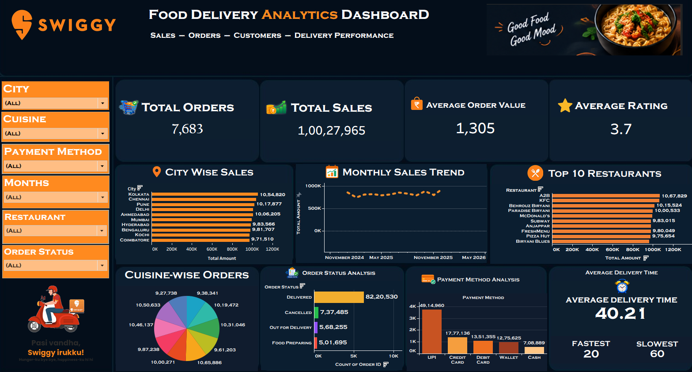

Swiggy Data Analysis Dashboard Using Tableau

📌 Project Overview

This project analyzes Swiggy food delivery data using Microsoft Excel and Tableau. The goal is to explore sales performance, restaurant performance, cuisine preferences, payment methods, and delivery trends through interactive data visualizations.

🎯 Project Objectives

Analyze overall sales and average order amount.
Compare sales across different cities.
Identify the top 10 restaurants based on sales.
Explore cuisine-wise order distribution.
Understand customer payment method preferences.
Analyze delivery time and key performance indicators (KPIs).
Present insights through an interactive Tableau dashboard.
🛠️ Tools and Technologies
Tableau: Dashboard development and data visualization.
Microsoft Excel: Dataset storage and data preparation.
Data Analytics: Exploratory analysis and KPI reporting.

📂 Dataset Description

The project uses the Swiggy dataset available in Swiggy.xlsx.

The dataset is used to explore food delivery orders, sales amounts, restaurant performance, cuisine categories, payment methods, and delivery-related metrics, depending on the available columns.

📊 Analysis Performed

1. City-wise Sales Analysis

Compare sales performance across cities and identify differences in sales contribution.

2. Top 10 Restaurants by Sales

Rank restaurants based on sales to identify the highest-performing restaurants.

3. Cuisine-wise Order Analysis

Explore order distribution across cuisine categories and identify popular food choices.

4. Payment Method Analysis

Analyze the distribution of orders across available payment methods.

5. KPI Analysis

Present key metrics such as total sales, average amount, and other available delivery performance indicators.

6. Delivery Time Analysis

Explore delivery time metrics to understand delivery performance.

🖼️ Dashboard Preview

📁 Repository Files
Swiggy.xlsx – Dataset used for the analysis.
Swiggy_Dashboard.twb – Tableau workbook.
dashboard.png – Dashboard screenshot.
LICENSE – Repository license.

💡 Key Learning Outcomes
Working with a dataset in Excel and Tableau.
Building charts and KPI visualizations.
Comparing performance across categories.
Creating dashboards to communicate analytical findings.
Organizing a data analytics project for a portfolio.

🏁 Conclusion

This project demonstrates the use of Tableau to analyze food delivery data and present business-related insights in a visual format. It provides practical experience in data visualization, KPI analysis, and dashboard development.

👨‍💻 Author

Ajay Kumar

GitHub Profile: aju760

🔗 Project Repository

Swiggy Data Analysis using Tableau

